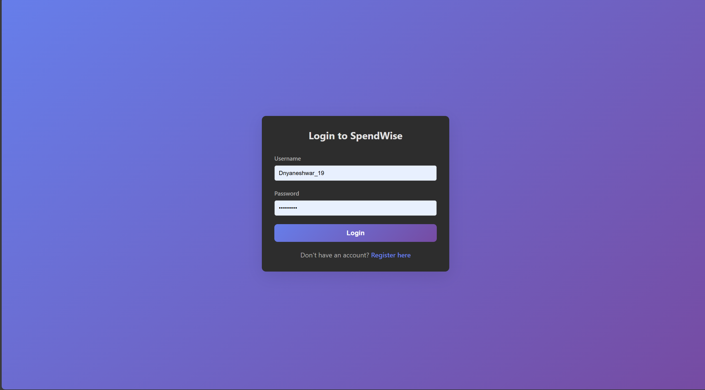
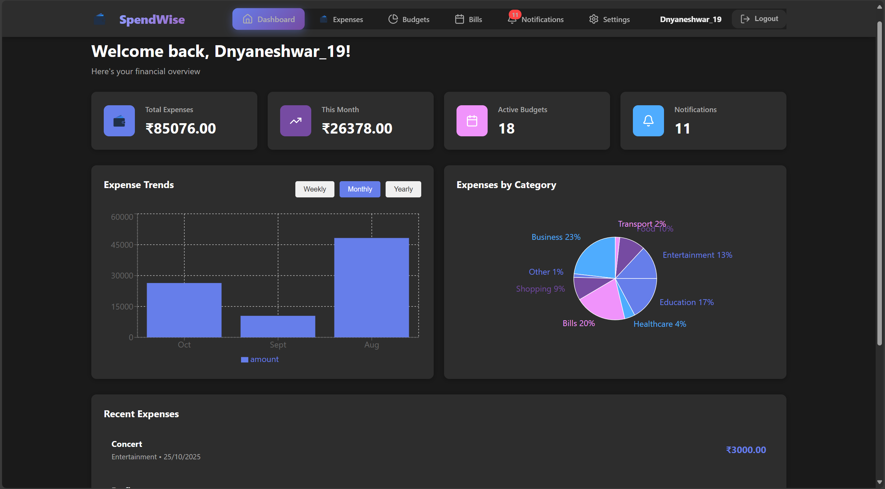
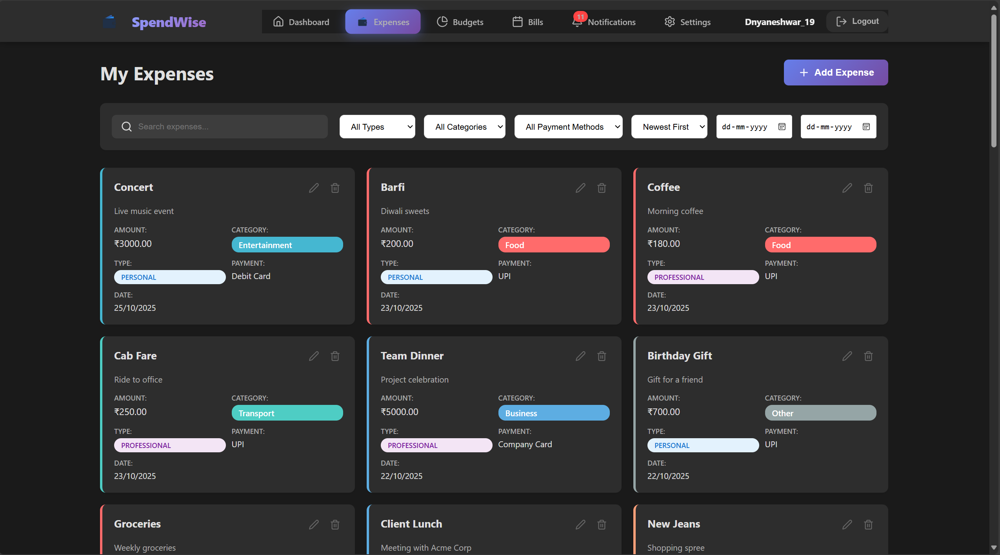
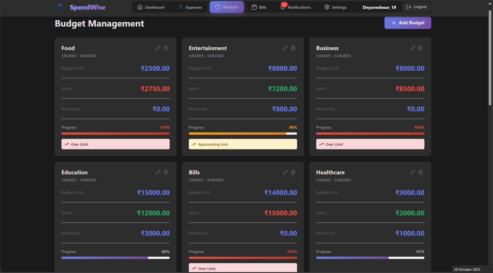
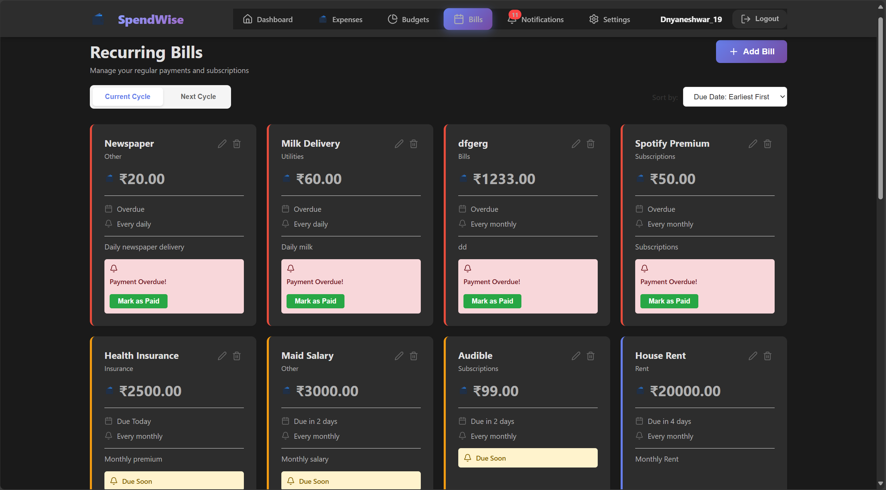
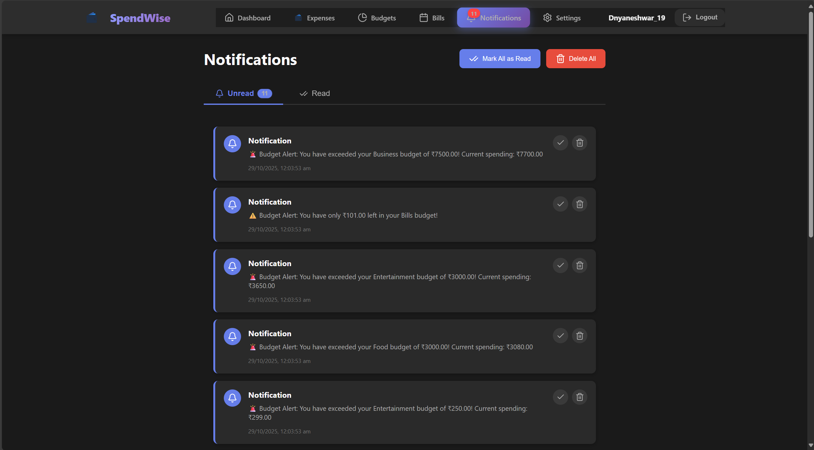
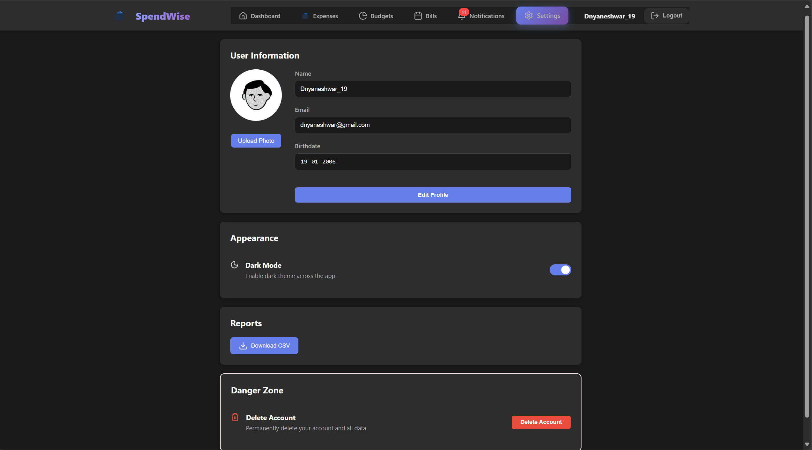

# 💰 Expenses Tracker

A modern full-stack **Expense Management System** built with **React**, **Spring Boot**, and **MySQL** — designed to help users manage, track, and visualize their daily expenses effortlessly.  
Easily view Insights, Budgets, Bills and Reports — all in one dashboard.

---

## 📑 Table of Contents

- [📸 Project Preview](#-project-preview)
- [📦 Tech Stack](#-tech-stack)
- [✨ Features](#-features)
- [🚀 Steps to Run the Application on Your Laptop](#-steps-to-run-the-application-on-your-laptop)
- [💡 Developed By](#-developed-by)

---

# 📸 Project Preview

## Authentication

<p align="center" >
  </p>

## Dashboard

<p align="center">
  
</p>

## Expenses

<p align="center">
  </p>

## Budget

<p align="center"></p>

## Bills

<p align="center"></p>

## Notification

<p align="center"> </p>

## Setting

<p align="center"> </p>

## Report

<p align="center">  </p>

---


> 🎬 _Click the thumbnail above to watch the full 4-minute demo video on YouTube!_

---

## 📦 Tech Stack

| Layer             | Technologies                    |
| ----------------- | ------------------------------- |
| Frontend          | React.js, HTML, CSS, JavaScript |
| Backend           | Spring Boot (Java)              |
| Database          | MySQL                           |
| Containerization  | Docker                          |
| API Communication | REST API + Axios                |

---

## ✨ Features

### 👤 User Management

- Secure user registration and login
- Password encryption using BCrypt
- Role-based access (User/Admin)
- Profile management (update name, email, photo, birthdate)
- Dark mode
- Account deletion with full data removal

---

### 💵 Expense Management

- Add, view, update, and delete expenses
- Pin/unpin important expenses
- Filter by category, payment method, or date range and many more
- Search and sort expenses instantly
- Each expense linked to the logged-in user

---

### 🎯 Budget Management

- Create budgets per category/time period
- Real-time budget tracking and alerts
- Auto calculation of remaining balance
- Manage multiple budgets simultaneously

---

### 🔁 Recurring Bills

- Manage recurring bills (rent, subscriptions, EMIs, etc.)
- Track frequency, next due date, and payment history
- Set reminders for upcoming or overdue bills
- Once the bill due date is over after marking as paid , it continues to next cycle and comes back to current cycle 7 days before duedate

---

### 🔔 Notifications

- Budget limit alerts
- Bill payment reminders
- View all/unread notifications
- Mark as read or delete

---

### 📊 Reports & Analytics

- Download reports (CSV)
- Interactive dashboard with:
  - Expense charts (bar/pie)
  - Top categories and recent transactions

---

### 🎨 UI / UX

- Responsive modern design (desktop & mobile)
- Clean card-based layout
- Real-time validation and toasts
- Accessibility support (dark mode)

---

### 🔒 Security

- Encrypted passwords
- Role-based access
- CSRF + XSS protection
- Data isolation per user
- Secure session management

---

## 🚀 Steps to Run the Application on Your Laptop

> 🧩 **Prerequisite:** Install and Sign in to **Docker Desktop**

---

### **Step 1: Install Docker Desktop**

- Go to 👉 [Docker Desktop Official Site](https://www.docker.com/products/docker-desktop/)
- Download and install for **Windows** or **Mac**
- Launch Docker and ensure it shows:  
  ✅ _“Docker Desktop is running”_ (whale icon turns green)

---

### **Step 2: Prepare the Project Files**

1. Create a folder on your Desktop named **my-expenses-tracker**
2. Place the provided file `expenses_tracker_runInDocker.rar` inside it
3. Extract the `.rar` file
4. Make sure your folder structure looks like this:

```

my-expenses-tracker/
├── docker-compose.yml
└── init-db/
└── backup.sql

```

> ⚠️ Important: The `docker-compose.yml` file **must** be directly inside `my-expenses-tracker/` (not in a subfolder).

---

### **Step 3: Launch the Application**

Open **Command Prompt / PowerShell / Terminal**, then:

```bash
cd path\to\my-expenses-tracker
docker compose up -d
```

> 🐳 Docker will automatically pull required images (backend, frontend, MySQL) and start everything in a private network.

---

### **Step 4: Access the Application**

Wait about 1 minute for services to start, then open:

👉 **[http://localhost](http://localhost)**

The app will load with initial demo data.
Any new data you add will be stored **persistently** on your machine.

---

