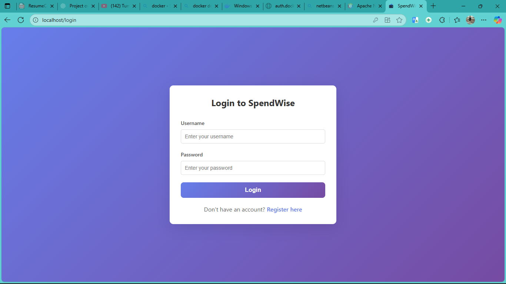
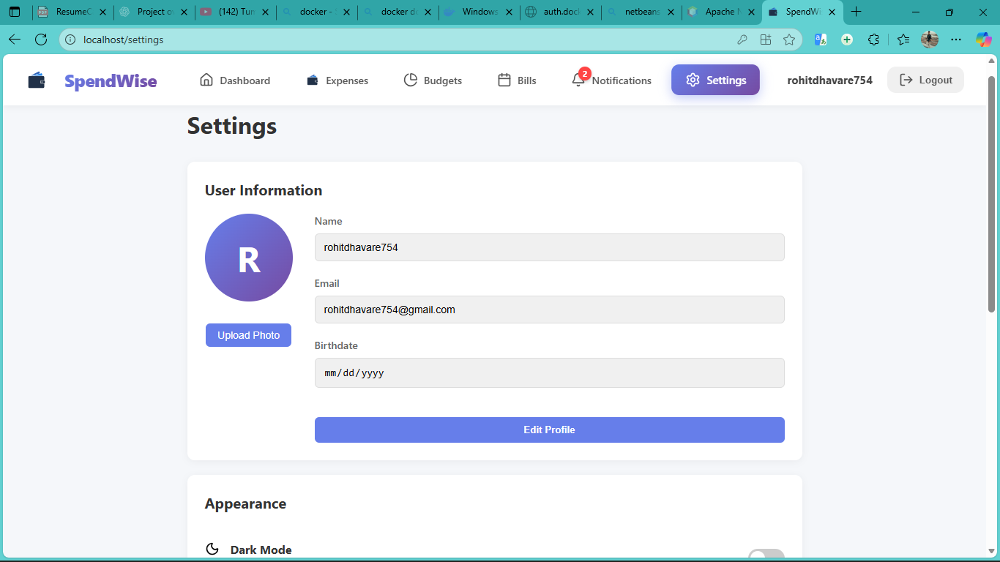
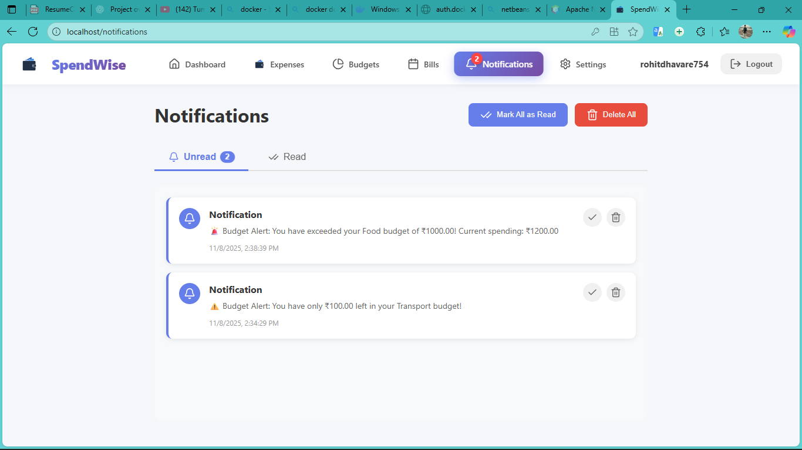
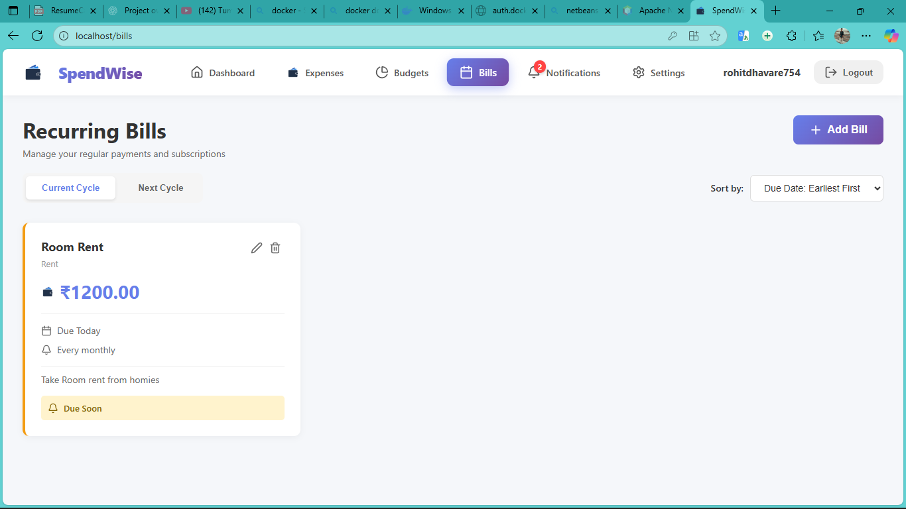
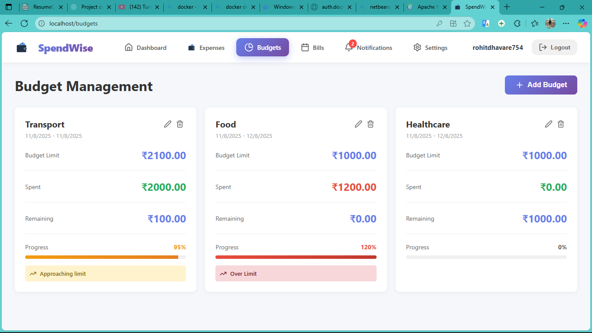
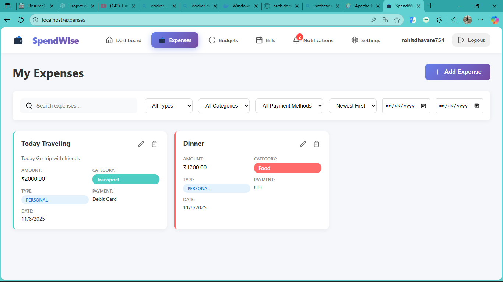
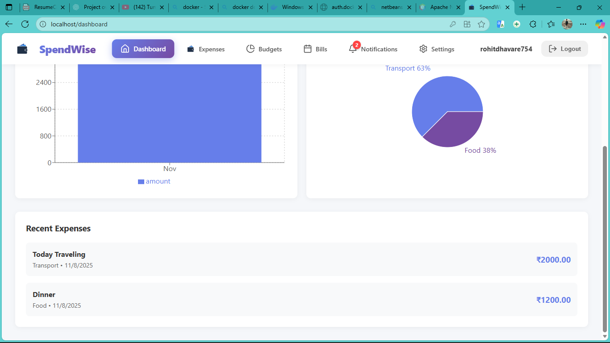

# 💰 Expenses Tracker

A modern full-stack **Expense Management System** built with **React**, **Spring Boot**, and **MySQL** — designed to help users manage, track, and visualize their daily expenses effortlessly.  
Easily view Insights, Budgets, Bills and Reports — all in one dashboard.

---

## 📑 Table of Contents

- [📸 Project Preview](#-project-preview)
- [📦 Tech Stack](#-tech-stack)
- [✨ Features](#-features)
- [🚀 Steps to Run the Application on Your Laptop](#-steps-to-run-the-application-on-your-laptop)
- [💡 Developed By](#-developed-by)

---

# 📸 Project Preview

  

  

  

  

  

  

  

  

---

> 🎬 _Click the thumbnails above to explore the complete project UI!_

---

## 📦 Tech Stack

| Layer             | Technologies                    |
| ----------------- | ------------------------------- |
| Frontend          | React.js, HTML, CSS, JavaScript |
| Backend           | Spring Boot (Java)              |
| Database          | MySQL                           |
| Containerization  | Docker                          |
| API Communication | REST API + Axios                |

---

## ✨ Features

### 👤 User Management
- Secure user registration and login
- Password encryption using BCrypt
- Role-based access (User/Admin)
- Profile management (update name, email, photo, birthdate)
- Dark mode
- Account deletion with full data removal

---

### 💵 Expense Management
- Add, view, update, and delete expenses
- Pin/unpin important expenses
- Filter by category, payment method, or date range
- Search and sort expenses instantly
- Each expense linked to the logged-in user

---

### 🎯 Budget Management
- Create budgets per category/time period
- Real-time budget tracking and alerts
- Auto-calculation of remaining balance
- Manage multiple budgets simultaneously

---

### 🔁 Recurring Bills
- Manage recurring bills (rent, subscriptions, EMIs, etc.)
- Track frequency, next due date, and payment history
- Set reminders for upcoming or overdue bills
- Automatically continues to next cycle after payment and reappears 7 days before the next due date

---

### 🔔 Notifications
- Budget limit alerts
- Bill payment reminders
- View all/unread notifications
- Mark as read or delete

---

### 📊 Reports & Analytics
- Download reports (CSV)
- Interactive dashboard with:
  - Expense charts (bar/pie)
  - Top categories and recent transactions

---

### 🎨 UI / UX
- Responsive modern design (desktop & mobile)
- Clean card-based layout
- Real-time validation and toasts
- Accessibility support (dark mode)

---

### 🔒 Security
- Encrypted passwords
- Role-based access
- CSRF + XSS protection
- Data isolation per user
- Secure session management

---

## 🚀 Steps to Run the Application on Your Laptop

> 🧩 **Prerequisite:** Install and sign in to **Docker Desktop**

---

### **Step 1: Install Docker Desktop**

- Go to 👉 [Docker Desktop Official Site](https://www.docker.com/products/docker-desktop/)
- Download and install for **Windows** or **Mac**
- Launch Docker and ensure it shows:  
  ✅ _“Docker Desktop is running”_ (whale icon turns green)

---

### **Step 2: Prepare the Project Files**

1. Create a folder on your Desktop named **my-expenses-tracker**
2. Place the provided file `expenses_tracker_runInDocker.rar` inside it
3. Extract the `.rar` file
4. Make sure your folder structure looks like thi

##Developed By ----- Rohit Dhavare
